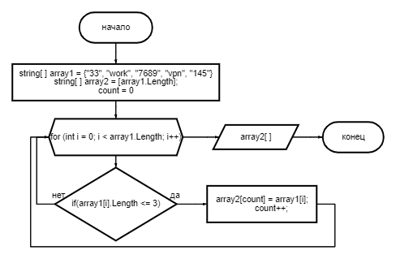

# *__FinalWork__*

## Диаграмма по задаче

## Описание решения:
Прописсываю команду отчистки экрана при старте (для удобства).

Создаю метод под названием FinalWork в котором 
создаю два массива "array1" и "array2". "array1"
заполнен сразу и имеет длинну в [5] элементов, 
"array2" имеет длинну "array1". В этом же методе
прописываю вызов двух дополнительных методов:

метод "SamplingFromAnArray" принимает два параметра,
два массива строчного типа. Метод перебирает массив 
"array1" и ищет элементы, длинна которых меньше или 
равна 3, при нахождении такого элемента, его записывает 
в массив "array2" на позицию "array2[count]", счётчик 
"count"после каждого нахождения элемента растёт на 1. 
Изначально count = 0, создан такой счётчик для того, 
что бы при выборке и выводе на экран "array2" 
не было лишних пробелов.

метод PrintArray принимает 1 параметр, массив строчного 
типа. Метод перебирает массив и выводит каждый элемент
массива на экран.